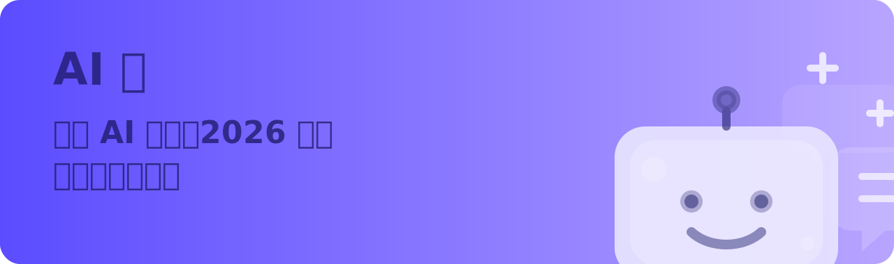

[`Português (BR)`](README.md) | [`English`](en/README.md)

# Sobre o Projeto

Um guia avançado para aprender inglês que pode te beneficiar muito.

[English Level Up Tips — Um Guia de Estudos de Inglês Fora do Comum](https://github.com/byoungd/English-level-up-tips).

> **🇧🇷 Esta é uma tradução para o português brasileiro do guia original.**

## Níveis de Proficiência em Inglês

> Baseado principalmente na [Global scale - Table 1 (CEFR 3.3): Common Reference Levels](http://www.coe.int/en/web/common-european-framework-reference-languages/table-1-cefr-3.3-common-reference-levels-global-scale)

## Diferenciais

## Capítulos

O capítulo sobre IA foi atualizado para a versão `2026`. O foco não está mais apenas em prompts genéricos, mas em responder de forma mais sistemática:

- Por que o `Gemini` é hoje a melhor escolha como motor principal para aprender inglês
- Como integrar `Gem / Live / Guided Learning / Canvas / quiz / flashcards` em um fluxo completo de treinamento
- Além do Gemini, como `ChatGPT / Claude / Perplexity / DeepL Write` devem ser usados em conjunto
- Como projetar um ciclo de treinamento de listening, speaking, reading e writing que realmente funcione a longo prazo

Se você quer transformar a IA em um verdadeiro acelerador do seu aprendizado de inglês — e não apenas usá-la para traduzir uma frase ou outra — vale a pena ler este capítulo com atenção.

[Minha História](threads/part-2/my-story.md)

## Agradecimentos

- Obrigado a todos que se importam e contribuíram para este guia ❤️

## Extra

Quer saber sobre minha vida amorosa? Leia [Minhas Ex-namoradas Fora do Comum](https://github.com/byoungd/how-to-find-love)

Se quiser ler sobre o período após o fracasso do meu negócio, confira: [Minha História](threads/part-2/my-story.md)

## Leitura Online

- Zhihu [Guia de Estudos de Inglês Fora do Comum](https://zhuanlan.zhihu.com/p/444211376)
- GitHub Pages [English-level-up-tips](https://byoungd.github.io/English-level-up-tips/#/)
- GitBook [English-level-up-tips](https://babyyoung.gitbook.io/english-level-up-tips/)

## Direitos de Reprodução

Ao reproduzir este guia, por favor, mencione o autor e o link do GitHub. Obrigado!

## Licença

Este trabalho está licenciado sob a Licença Creative Commons Atribuição-Uso Não Comercial 4.0 Internacional.

 

## Aviso Especial

Muitos amigos entraram em contato dizendo que o guia foi feito com muito carinho e que os ajudou de alguma forma, querendo fazer uma doação.

**O destino já deu a este guia mais presentes do que ele merece — não preciso de mais recompensas.**

Declaro oficialmente: **Este guia não aceita nem precisa de patrocínio financeiro.**

Use o dinheiro que você gastaria com doações para comprar bons livros.

> Aprender — não é essa a melhor diversão da vida?

> Cheers and Enjoy :)
