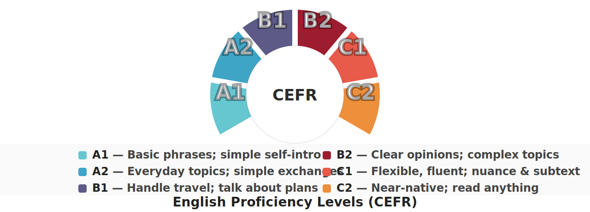
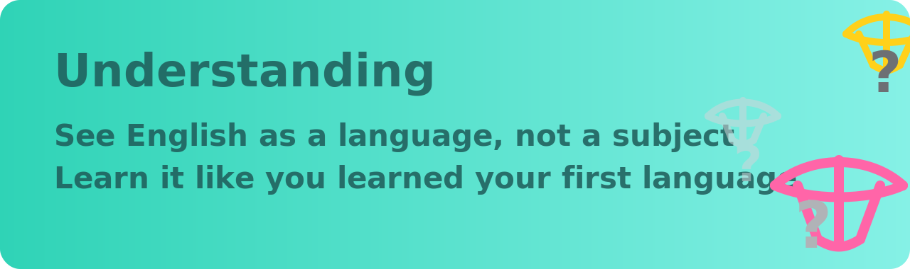
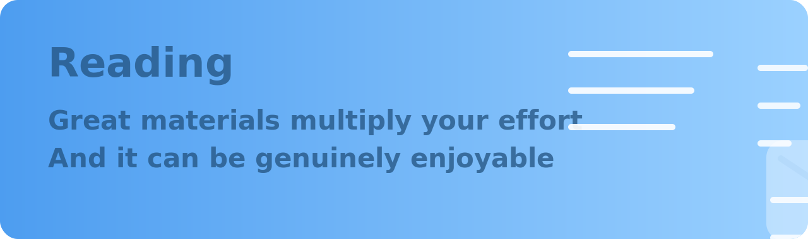
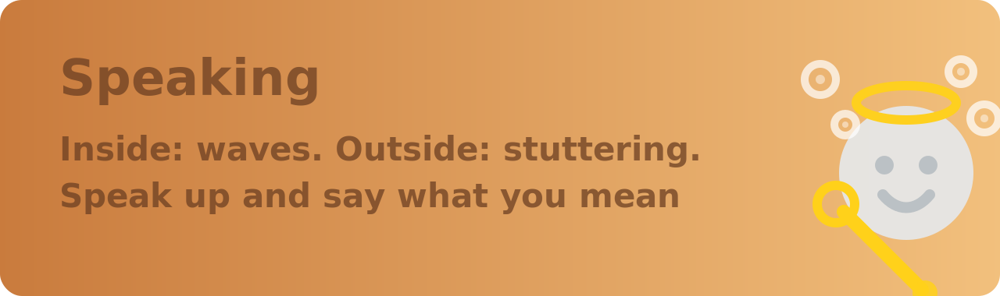
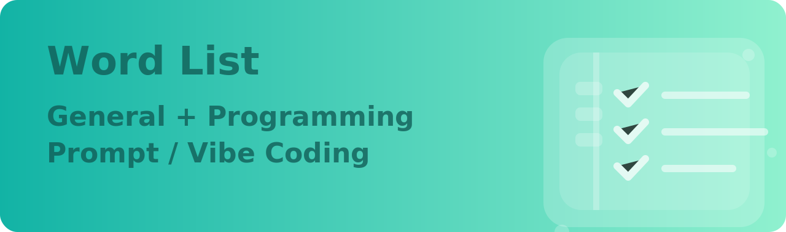

[`Português (BR)`](../README.md) | [`English`](README.md)

# An advanced guide to learn English which might benefit you a lot.

## English Proficiency Levels

> Based mainly on the [Global scale - Table 1 (CEFR 3.3): Common Reference Levels](http://www.coe.int/en/web/common-european-framework-reference-languages/table-1-cefr-3.3-common-reference-levels-global-scale)

## Features

**Structured** — Build a knowledge framework first. Structure first, details later.

**Phased** — Divide learning into stages and modules. Step by step.

**Targeted** — Focus on your needs and available time. Make use of free moments.

**Practical** — Practice real outcomes: resumes, emails, writing, notes, blogs.

**Actionable** — Curated materials and examples. Easy to follow.

**Low cost** — Mostly free or low-cost resources. Learn efficiently spending less.

## Chapters

The AI chapter has been updated to version `2026`. The focus is no longer just on generic prompts, but on answering more systematically:

- Why `Gemini` is today the best choice as the main engine for learning English
- How to integrate `Gem / Live / Guided Learning / Canvas / quiz / flashcards` into a complete training workflow
- Beyond Gemini, how `ChatGPT / Claude / Perplexity / DeepL Write` should be used together
- How to design a training cycle for listening, speaking, reading and writing that actually works long-term

If you want to turn AI into a true accelerator for your English learning — and not just use it to translate a phrase here and there — this chapter is worth reading carefully.

---

<small>This guide is based on the original guide by [byoungd](https://github.com/byoungd) — [English-level-up-tips](https://github.com/byoungd/English-level-up-tips).</small>
