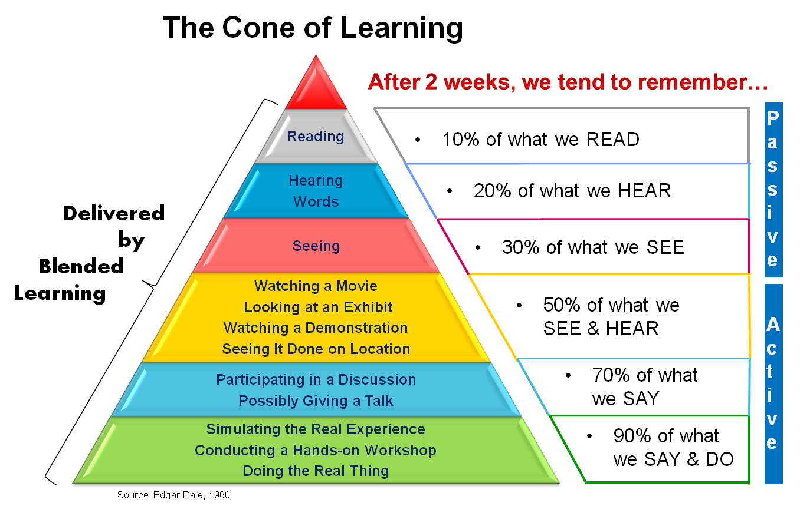

# Cognição

Este capítulo aborda, do ponto de vista cognitivo, algumas questões que você deve considerar antes de começar a estudar inglês de forma sistemática.

---

## Resumo (TL;DR)

- Entenda: **por que você quer aprender inglês e o que realmente deseja** — defina seus objetivos.
- Perceba que: **entrada passiva (ler e ouvir) não é suficiente** — você precisa de mais "ação, fala e produção".
- Aprenda a criar **cenários e ritmos adequados** para si, em vez de sacrificar o sono e a saúde.
- Aprenda a **reconhecer e lidar com suas emoções com gentileza**, em vez de se motivar apenas com culpa e pressão.
- Crie um **ambiente seguro e imersivo em inglês**, tão natural quanto escovar os dentes.

> Se você está cheio de culpa, ansiedade e procrastinação em relação a "aprender inglês", este capítulo vai te ajudar a colocar essas emoções no lugar certo.

---

## Por que devemos aprender inglês bem

Primeiro, precisamos entender que **o inglês é um idioma extremamente utilizado**. Isso pode ser visto na distribuição de idiomas no conteúdo da Wikipédia:

O inglês, como o idioma mais falado no mundo, cobre praticamente todos os aspectos da vida.

- Seja para simples troca de informações ou para livros e artigos acadêmicos rigorosos, o inglês representa uma parcela considerável.
- Aprender inglês bem é como abrir uma porta para um novo mundo — você não fica mais limitado aos seus canais de informação originais e pode acessar conteúdos muito mais amplos e ricos do que apenas o mundo em português.

Se você trabalha com tecnologia, a exigência com inglês é ainda maior:

- Novas tecnologias, frameworks e ideias **surgem primeiro em inglês**.
- Traduções inadequadas podem distorcer nossa compreensão de conceitos técnicos.
- Mas, justamente por estarmos nessa área, temos mais acesso a ferramentas excelentes que tornam o aprendizado de inglês **mais eficiente e divertido**.

Em outras palavras: **aprender inglês não é só para passar em provas — é para se conectar com um mundo maior**.

---

## A Pirâmide de Aprendizagem: Por que "se mexer"

O pesquisador americano Edgar Dale propôs em 1969 a famosa "Pirâmide de Aprendizagem" (The Cone of Learning). A ideia central é: duas semanas após o aprendizado inicial, o cérebro retém aproximadamente:

- Apenas lendo: cerca de 10%
- Apenas ouvindo: cerca de 20%
- Vendo imagens: cerca de 30%
- Assistindo vídeos/demonstrações: cerca de 50%
- Participando de discussões, perguntando, falando: cerca de 70%
- Fazendo apresentações, ensinando, simulando, praticando: cerca de 90%

Essa teoria é controversa no meio acadêmico — os números não são precisos — mas a **direção geral** está correta:

> A entrada passiva (ler, ouvir) é muito menos eficaz do que a participação ativa (falar, escrever, explicar, usar).

Para o aprendizado de idiomas, isso é ainda mais evidente:

- Só com "ler" e "ouvir", a compreensão fica na superfície.
- O que realmente se fixa e se usa é quando você **consultou o dicionário, fez anotações, escreveu frases, falou em voz alta**.

Portanto, este guia vai te lembrar constantemente: **comece a produzir ativamente o quanto antes. Não fique só no ler e ouvir.**

---

## Uma Experiência de Fracasso por "Forçar Demais"

Quase todos nós passamos pela fase de educação tradicional: treinamento pesado, estudo exaustivo, acordar cedo e dormir tarde. Quando temos um pequeno sucesso, ficamos eufóricos; quando vamos mal, caímos na culpa e na ansiedade. Alguns até acham que estudar tem que ser sofrido.

No ensino médio, eu estava num ambiente de pressão extrema:

- Meus colegas de quarto eram, respectivamente, o primeiro, o segundo e o oitavo colocados da cidade no vestibular — o primeiro e o segundo eram "gênios", de óculos, sempre curiosos, parecendo alunos do quinto ano.
- Para me motivar, pedi à coordenadora para trocar de lugar e sentar ao lado do primeiro colocado, com o segundo na fileira da frente.

Naquela época, meu ritmo era mais ou menos assim:

- Acordava às 5:20 para ir ao pátio decorar matéria.
- Ficava na sala no intervalo do almoço "estudando", cochilando minutos antes da aula voltar.
- Era sempre o primeiro a sair do refeitório no jantar, correndo como se estivesse numa prova de 100 metros para voltar à sala e garantir o lugar.
- Voltava do estudo noturno, tomava banho correndo, lia na cama e, quando apagavam as luzes, ligava a luminária escondido para continuar.

Eu achava que estava "aproveitando cada segundo", mas na verdade estava **fracassando repetidamente**. Ajustava minha mentalidade, tentava de novo, mas minhas notas só caíam. Uma vez fiquei em 500º lugar na série — quase entrei em desespero.

Eu não entendia: **"Estudo tanto, por que minhas notas estão piores?"**

Meu colega de carteira, por outro lado, usou a bolsa de estudos que acabara de ganhar para comprar um notebook e assistia séries americanas escondido durante a aula. E as notas dele eram sempre as melhores.

WHY?

WHY?

WHY?

Depois, fui entendendo: eu estava cometendo uma série de erros clássicos.

---

## A Motivação Fundamental: Para que você está estudando?

Primeiro, se pergunte:

- Por que eu quero estudar tanto?
- É só para tirar notas altas?
- Depois de conseguir uma boa colocação, fico ainda mais ansioso, com medo de perder?
- Pensando a longo prazo, como eu quero que minha vida seja?

Se estudar deveria tornar a vida **melhor**, quando você estuda de um jeito extremamente doloroso, já está invertendo as prioridades.

Muitas vezes, basta **mudar a mentalidade e o ritmo**:

- Estudar de forma mais leve aumenta a felicidade.
- Não se prender à cruz do "tenho que me esforçar" torna mais fácil persistir.

Só quando você **se conhece, se aceita e se cuida** é que consegue se dedicar de verdade ao que gosta, brincar, suar e colher os frutos.

> Isso foi algo que uma **aluna ruim** me ensinou.
> Ela adorava ouvir música com fones de ouvido, com um sorriso caloroso no rosto — algo que não era permitido na escola.

    As palavras dela me libertaram. Parei de me forçar com discursos motivacionais, comecei a aceitar minha mediocridade e a sentir a beleza da vida.

**Pequeno exercício: três perguntas para você**

1. Sem considerar provas e notas, o que eu mais quero "ganhar" com o inglês?
2. Na vida ideal daqui a cinco anos, qual o papel do inglês?
3. Existe algum método de estudo que você genuinamente goste?

---

## Defina o Cenário: Primeiro, entenda "onde você vai usar"

Antes de estudar inglês, divida suas necessidades. Cada cenário exige um foco diferente.

- **Para provas**: vestibular, ENEM, concursos, certificações
  Foco: tipos de questão, notas de corte, estratégias de prova, técnicas de exame.
- **Para intercâmbio**: TOEFL, IELTS, GRE, comunicação diária
  Foco: equilíbrio entre as quatro habilidades, escrita acadêmica, apresentações e participação em aula.
- **Para uso não acadêmico**: trabalho, tecnologia, viagens, desenvolvimento pessoal
  Foco: vocabulário da área, e-mails e documentos, comunicação em reuniões, expressão autêntica.

**Escreva de forma simples:**

> Meu cenário principal é: ________
> O que eu mais preciso melhorar é: ouvir / falar / ler / escrever / provas (escolha 1-2)

Todas as suas escolhas (material, prática, tempo investido) devem girar em torno desse cenário principal. Isso torna tudo mais leve.

---

## Acordar Cedo Pode Arruinar o Dia: Não Troque Saúde por "Sensação de Esforço"

Para ganhar 30 minutos de estudo matinal, o preço que paguei foi:

- Ficar com sono durante as aulas da manhã, reduzindo drasticamente a eficiência.
- Dormir só entre 0:30 e 1:00 e acordar às 5h — corpo severamente privado de descanso.
- Todos os "momentos que dava para encaixar estudo" foram espremidos — e no fim, eu roubava tempo das aulas.

Resultado:

- Não conseguia prestar atenção total na aula, nem dormir direito.
- Parecia muito "esforçado", mas o resultado era pífio.

> Não sacrifique o tempo que deveria ser usado para dormir.
> Caso contrário, você não vira um "gênio" — vira um "zumbi".

Naquela época, eu e meu colega tínhamos um hobby em comum: discutir redações nota máxima. Juntamos dinheiro para comprar um MP3 que lia arquivos `.txt` — isso mesmo, um **MP3**. Toda noite, um de nós lia uma redação em voz alta até pegar no sono.

    Sempre ficávamos com gostinho de "quero mais" e discutíamos até dormir.

Esse tipo de estudo, **com prazer e sem sacrificar o corpo**, tinha resultados muito melhores.

---

## Não se Compare com Quem Está em Outro Nível

Além da diferença de hábitos, existe a realidade de que as pessoas têm capacidades, bases e ritmos de aprendizado diferentes.

- Definir cegamente um "gênio" como meta e se sobrecarregar de tarefas leva à exaustão e culpa diárias.
- Metas altas e vagas trazem autoconfiança destruída e dúvidas constantes.

`Don't push yourself too hard!`

> "Há três momentos de amadurecimento na vida:
> O primeiro é quando você descobre que não é o centro do mundo;
> O segundo é quando descobre que, por mais que se esforce, há coisas que não pode mudar;
> O terceiro é quando aceita sua mediocridade e aprende a aproveitá-la." — Zhou Guoping

**Você precisa de metas adequadas ao seu momento atual, não ao ideal dos outros.**

---

## Não Gostar do Que Está Fazendo

Naquela época, eu estudava por estudar, aprendia por ranking:

- Quando subia de posição, tinha uma alegria passageira.
- Quando caía, mergulhava no medo, na culpa e na ansiedade.

Esse tipo de estudo não tem graça nenhuma e é difícil de sustentar.

Por outro lado, o aprendizado mais eficiente acontece quando é **movido por interesse, sem esforço forçado**:

- Pegar um bom livro, ler os primeiros capítulos, se encantar com a linguagem e ler tudo de uma vez.
- Ver alguém tocando ukulele e achar legal, procurar tutoriais, praticar, e depois de um tempo já estar tocando algumas músicas.

> Enjoy what you are doing!

Se você conseguir conectar o aprendizado de inglês com algo que realmente te interessa — como:
- Se gosta de séries, assista com áudio original + legendas em português, depois releia com legendas em inglês;
- Se gosta de tecnologia, leia documentação e issues em inglês;
- Se gosta de fofoca, frequente fóruns em inglês…
O processo fica muito mais leve.

---

## Ter um Plano de Estudos Adequado

Estudar exige **estratégia**. A distribuição do tempo não deve ser uniforme.

Naquela época, eu tinha alguns problemas claros:

- Não analisava minhas fraquezas — não conseguia "mirar no alvo certo".
- Para pontos difíceis, não buscava discussão, ajuda ou troca de ideias.
- Preenchia o dia com tempo mecânico, sem espaço para "resumo, revisão e transferência".

O mais eficiente é:

- Identificar seus pontos fracos (ex.: listening, vocabulário, escrita) e focar em um ou dois de cada vez.
- Manter "produção como motor": o que aprendeu, escreva, fale, use — mesmo que simples.
- Revisão periódica: reserve um tempo semanal para ver o que aprendeu e o que realmente fixou.

> Depois que ajustei meu método, parei de me pressionar tanto.
> O tempo real de estudo diminuiu (mas o **tempo efetivo** aumentou), e minhas notas subiram.

---

## Conhecendo Suas Emoções: Quem Está no Controle Quando Você "Não Quer Estudar"?

Ao aprender uma habilidade, você já deve ter passado por isso:

> Às vezes, a eficiência é altíssima, como se estivesse com uma ajuda divina;
> Às vezes, você simplesmente não está no clima — só quer mexer no celular ou jogar.

Quando você sente que "só não quer estudar", quem está realmente no controle?

Muitas vezes, são as **emoções** tomando a decisão.

No fundo da nossa mente, as emoções geralmente sabem melhor o que queremos.

- Uma coisa pequena pode te deixar sem vontade o dia inteiro.
- Às vezes não é "preguiça" — é ansiedade, medo ou raiva por trás.

O neurocientista americano Joseph E. LeDoux sugere que:
Ansiedade, medo, impaciência e outras emoções têm, no cérebro, duas vias que operam em paralelo. Quando as duas vias se complementam, reagimos de forma rápida e precisa a estímulos externos. Quando uma delas falha ou entram em conflito severo, surgem os problemas psicológicos.

> Você não precisa entender neurociência. Só precisa saber:
> Muitas vezes, o "não querer estudar" não é um problema moral — é um sinal do seu cérebro.

Aprenda a **reconhecer suas emoções, cumprimentá-las**, em vez de reprimi-las ou se culpar:

- Quando sentir resistência, se pergunte: é cansaço? Dificuldade? Tédio?
- Tente uma abordagem mais leve (outro material, outro horário) em vez de forçar.
- Dê a si mesmo um "buffer emocional" antes de voltar à tarefa.

> Filme recomendado: *Divertida Mente* (Inside Out)
> Ele mostra de forma simples que as emoções não são inimigas — são parceiras que nos ajudam a entender o que realmente precisamos.

---

## O Que Fazer e o Que Não Fazer

**Este guia NÃO recomenda:**

- Se tratar como um **monge asceta** e se esgotar.
- Estudar durante a madrugada, ler no ônibus, ouvir inglês enquanto pedala — arriscando sua segurança.
- Provar seu esforço com "noites em claro e dias exaustivos".

Aquilo que você conquistou com "explosão de força" vai cobrar o preço em dobro no futuro — em fadiga e problemas de saúde.

> **Quem força demais não chega longe.**

**Este guia recomenda:**

- Seguir métodos científicos, **distribuir o tempo de forma racional e constante**.
- Através de bons hábitos, alcançar **mais com menos esforço**.
- Partir do pressuposto de que você já tem uma base de inglês e não acredita que "inglês é inútil".
- Manter uma atitude **séria** em relação ao aprendizado, aceitando que é algo que exige **persistência**.
- Confiar na ciência, adotar um plano adequado, respeitar seus limites e **aproveitar o processo. Enjoy!**

---

## Crie um Bom Ambiente de Inglês

Se possível, coloque-se "dentro do mundo do inglês".

- Consuma mídia apenas em inglês, como assistir `YouTube` em vez de plataformas locais.
- Siga criadores que falam inglês sobre temas que você realmente gosta: games, tecnologia, fitness, artesanato, cinema.
- Mude o idioma do celular e do computador para inglês (se não atrapalhar sua vida).

> Just make English **a part of your daily life**.
> Make it a habit like brushing your teeth.

Quando o inglês se torna um "ruído de fundo", você vai se surpreender: sua familiaridade, tolerância e receptividade ao idioma aumentam silenciosamente.

---

## Como os Bebês Aprendem a Falar

Se você prestar atenção em bebês, as falas deles são geralmente assim:

- "Mamãe, abri" — Mamãe, abre pra mim
- "Cheiroso, comidinha, mamãe" — A comida da mamãe é cheirosa
- "Bola, bebê, corre" — A bola do bebê rolou

Na maioria das vezes, entendemos o que eles querem dizer. E não achamos estranho — achamos fofo.

Isso revela dois fatos interessantes:

- Quando bebês se expressam, as palavras podem vir misturadas, "bagunçadas".
- Os pais geralmente não riem dos filhos — respondem com carinho, criando um ambiente **seguro** para a linguagem.

O mesmo princípio se aplica:

- Num ambiente seguro, você se sente à vontade para **falar sem medo**.
- No começo, pode usar palavras soltas, sem se preocupar com a gramática perfeita.
- Com o tempo, seu cérebro automaticamente organiza esses "fragmentos" em expressões mais naturais.

Então, a partir de agora, permita-se falar frases em inglês "incompletas", como um bebê. Não se critique.

> Se você tem coragem de abrir a boca, já venceu mais da metade.

Vamos começar pela parte mais básica — e também a mais crucial: **vocabulário**.

> Recomendações de vídeo:
>
> - [How to learn any language in six months | Chris Lonsdale | TEDxLingnanUniversity](https://www.youtube.com/watch?v=d0yGdNEWdn0)
> - [The first 20 hours -- how to learn anything | Josh Kaufman | TEDxCSU](https://www.youtube.com/watch?v=5MgBikgcWnY)

---

Próximo: [Vocabulário](2-vocabulary.md)
