# Minha História — O Que Aconteceu Comigo

## Gastar 20 Milhões para Abrir uma Empresa de Software e Falir: Como é a Sensação?

Olá, amigos. Eu sou o "Lí Pu" (apelido). Hoje vou contar uma história de empreendedorismo de internet bem absurda.

Em 1º de abril de 2017, entrei como desenvolvedor front-end comum na Nanjing xx Technology Co., Ltd., para desenvolver um software para advogados/escritórios de advocacia. A primeira versão do software foi feita por uma terceirizada — código sem comentários, sem gerenciamento de projeto, uma bagunça. Pra piorar, a empresa não tinha product manager. Toda ideia vinha "no chute" do dono.

No primeiro mês, o módulo que eu era responsável (linha do tempo) passou por mais de 20 versões. Com tanta alteração, fiquei louco.

Depois de um mês, a primeira versão foi testada e o resultado agradou o chefe. Em seguida, liderei a reestruturação do front-end com Vue.js. Após mais de seis meses de trabalho, finalmente lançamos. Começaram as vendas. Achávamos que pelo menos faríamos algum barulho no mercado — mas não. Passamos um longo período sem fechar **nenhuma** venda.

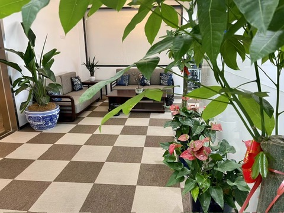

Com a empresa estagnada, os salários não subiam. Muitos colegas foram saindo. Ver gente com quem você riu e trabalhou indo embora — e saindo com rancor — era doloroso. Desde o começo, eu acreditava no potencial do produto. Mesmo com a equipe mudando várias vezes e meu salário congelado por anos, fiquei.

Fui de funcionário comum a líder de equipe, depois a gerente geral, e eventualmente me tornei sócio. A história absurda estava só começando.

Para conseguir trabalhar de cabeça fria, um tema importante não pode ser ignorado: o amor.

### Amor

Agradeço ao destino por ter me permitido encontrar alguém especial na hora certa. Ela se chama Ruohan (nome fictício). No [Guia de Estudos de Inglês Fora do Comum](https://github.com/byoungd/English-level-up-tips), usei uma frase de Gu Cheng para descrever como me senti ao vê-la: "A grama está semeando, o vento balança as folhas. Nós ficamos parados, sem dizer nada — e já é perfeito."

Em 19 de agosto de 2017, a acompanhei até Xangai para algo muito importante. Tiramos muitas fotos no Bund. Cada vez que vejo essas fotos, choro. Hoje, quando aparecem no celular, passo rápido. Não tenho coragem de reviver aquela dor.

Naquela noite, o céu estava lindo, mas o ar era pesado, sufocante. Olhando os prédios dos bancos no Bund, com a brisa do rio, nós dois tentávamos disfarçar a tristeza. Sabíamos que algo estava acontecendo — e não podíamos fazer nada.

Naquela noite, enquanto eu descrevia um futuro maravilhoso, ela começou a chorar — sem fazer barulho. Só percebi depois de um tempo. Lágrimas e ranho escorriam. Parecia que aquele futuro não era para ela. Ela se virou, de costas para mim. Naquele momento, percebi como ela era frágil.

Foi ali que entendi que a amava de verdade. Decidi que faria de tudo para fazê-la feliz.

Nos casamos e tivemos um filho lindo.

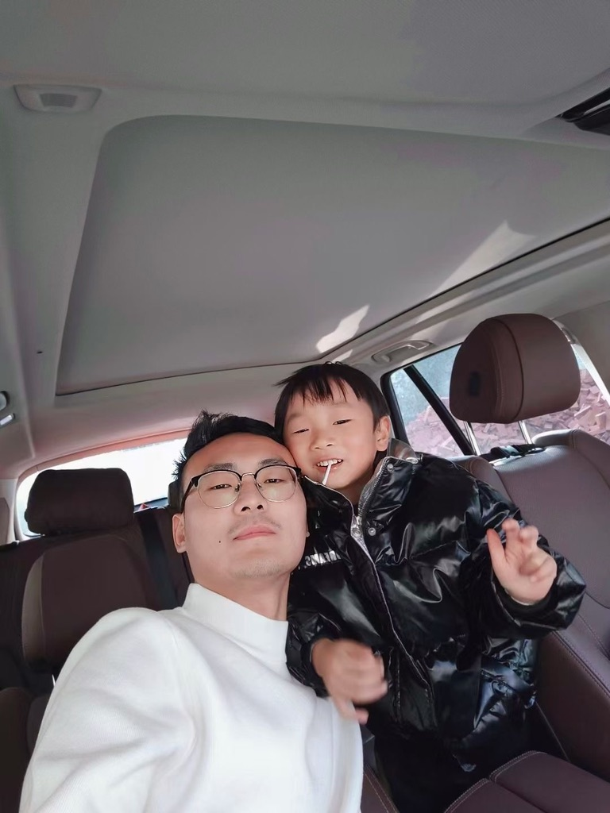

Depois, para expandir os negócios, comecei a investir em um resort de águas termais e um clube — e perdi muito dinheiro. Mas isso é história para outro dia.

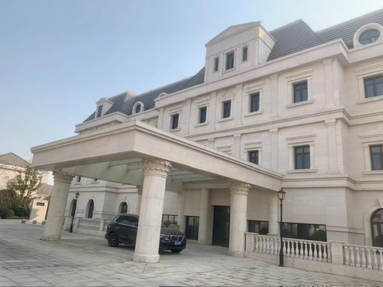

### Restaurante

Um parente meu abriu uma loja de sopa de carne com macarrão em Nanjing. O negócio ia muito bem. Meu primo abriu a segunda loja — um sucesso absoluto. Depois de estudar o mercado, abri a minha própria. O retorno superou todas as expectativas.

Comecei a fazer o design, a reforma, expandi o cardápio. Abri a segunda, a terceira loja…

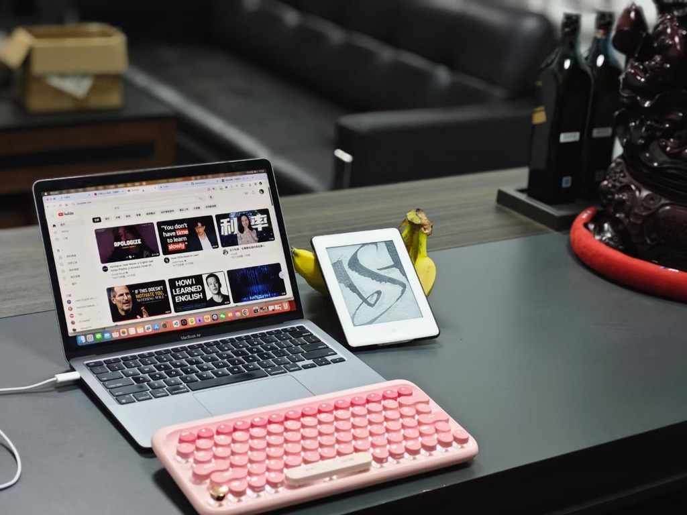

Para ter fotos melhores dos produtos nos aplicativos de delivery, aprendi fotografia e Photoshop do zero. Fiz todo o material visual.

Esses restaurantes pequenos dão um trabalho danado, mas o fluxo de caixa é muito bom. Mesmo tendo fechado todos durante a pandemia, deu para ganhar um bom dinheiro antes — e foi o que me permitiu virar sócio da empresa de tecnologia. Nesse período também realizei o sonho do meu carro.

### Gerenciando a Empresa

Quando a empresa começou a se equilibrar financeiramente, mudamos para um escritório maior. Em frente ao estande ainda sem decoração, eu sonhava com o futuro.

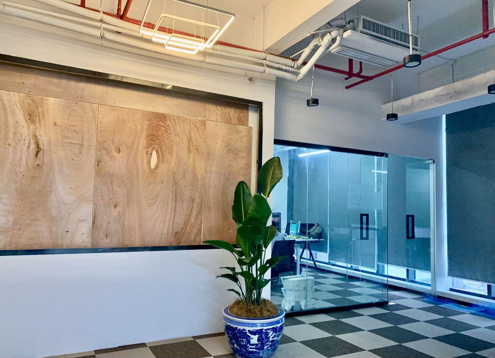

Para criar um bom ambiente, contratei algumas moças jovens e bonitas para animar o clima, aumentei os benefícios dos funcionários, e promovia eventos de confraternização regularmente.

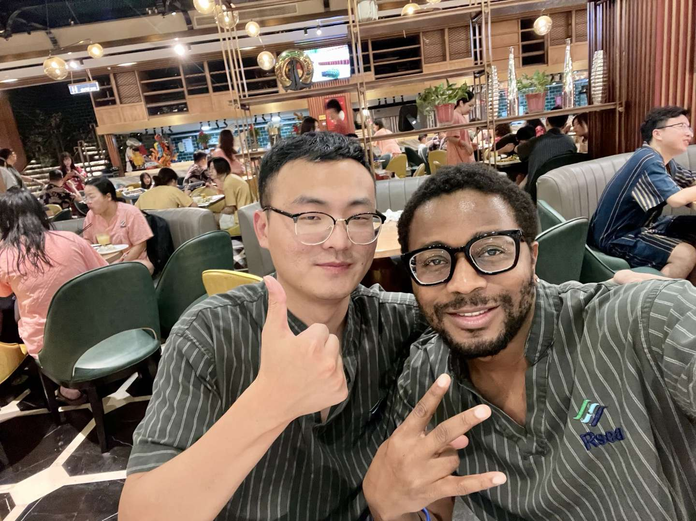

Acima, uma foto rara minha com o Nas, nosso líder de front-end.

Mas a bonança não durou muito. No início de 2022, as vendas do software despencaram — e não encontrávamos solução. O produto nunca me agradou totalmente: cheio de funcionalidades, mas também cheio de bugs. Sinceramente? Era um lixo. Os clientes reclamavam que o software tinha bugs a cada três passos — era "o pior dos piores". Se não fosse o preço baixo, já teriam nos processado.

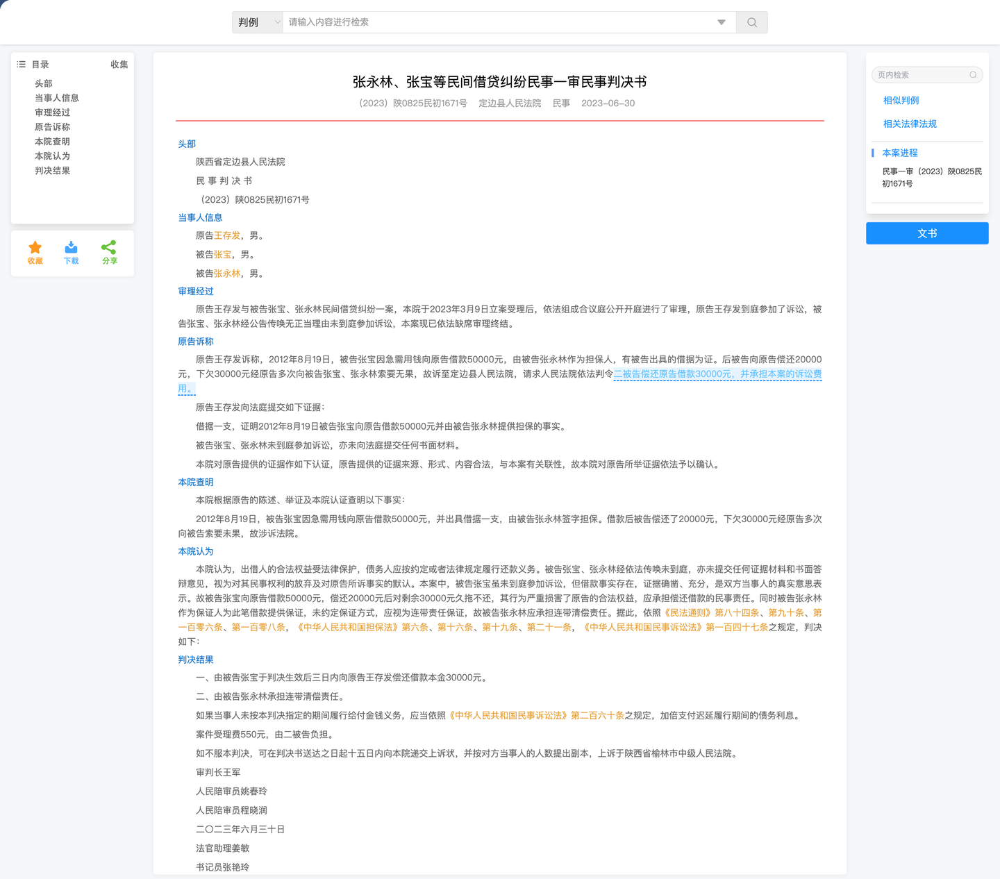

Para resolver problemas críticos, trouxe meu colega de escola (que trabalhava com segurança de containers na ByteDance). Sempre o considerei alguém especial. Quando ele entrou na empresa, descobriu problemas gravíssimos.

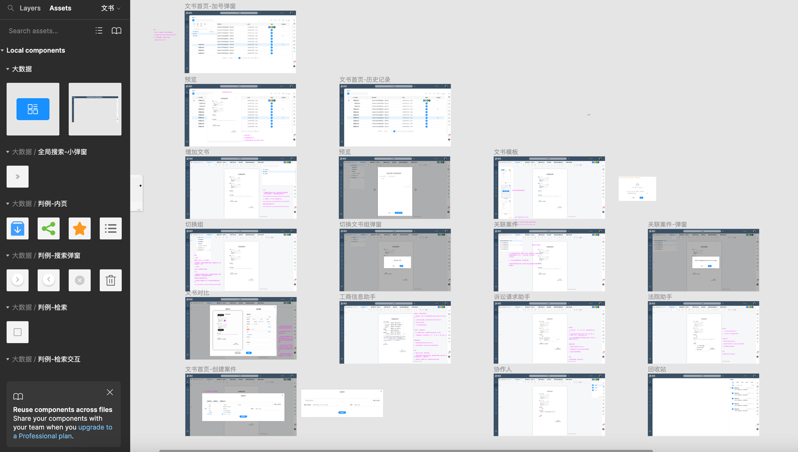

Primeiro, a estrutura do projeto era antiquada, com sérios problemas de performance e segurança. E muitas funcionalidades nem eram fruto de treinamento de IA — usavam busca elástica (ES) diretamente. Passamos anos fazendo "big data" que, na verdade, só entregava resultados pré-definidos. O que achávamos ser nosso ativo principal era, na realidade, um monte de lixo. E a maior parte do nosso esforço foi em adaptar para múltiplas plataformas e empilhar funcionalidades.

Investimos pesado em UI e detalhes de experiência do usuário. Mas o problema central — a falta de datasets — nunca foi resolvido. A extração de dados não tinha amostras. Não dava para treinar nada.

Ou seja: passamos anos fazendo big data sem sequer ter um conjunto de dados. Quando percebemos a gravidade, um calafrio percorreu minha espinha.

Nesse ponto, estávamos entre a cruz e a espada. Continuar iterando em cima daquilo era impossível — era uma montanha de lixo. Reconstruir? O dinheiro em caixa não dava nem para começar.

Naquela noite, eu e os outros dois sócios discutimos até tarde. O acionista majoritário, Sr. Gong (nome fictício), me perguntou: "Me diga uma coisa: isso tem jeito ou não? Se você disser que não tem, eu pulo daqui agora!"

Eu entendia perfeitamente o desespero dele. Ele já tinha investido mais de 10 milhões — tudo dinheiro próprio, sem um centavo de investidor externo. Eu também tinha colocado alguns milhões. Naquela hora, as palavras não conseguiam descrever o que sentíamos.

Depois disso, o Sr. Gong jogou sobre a mesa o manual do funcionário de 40 páginas que ele mesmo tinha escrito. O barulho foi tão alto que parecia que o escritório ia desabar. Algumas coisas já não funcionavam há tempos — mas a gente ainda alimentava ilusões.

Com a empresa quebrada, começamos a atrasar salários. Corremos atrás de dinheiro, fizemos empréstimos. Sob pressão extrema, o Sr. Gong começou a apertar o controle de ponto, cortar benefícios, exigir horas extras sem sentido, e até monitorar o trabalho dos funcionários. Passamos de relatórios semanais para diários, e depois para relatórios de hora em hora. Ele inventava cada vez mais maneiras de humilhar o time. Eu sabia que a dissolução da equipe era questão de tempo. Eu era contra essas palhaçadas, mas ele me calou com uma frase: "Fui eu que coloquei mais dinheiro. Quem manda sou eu!"

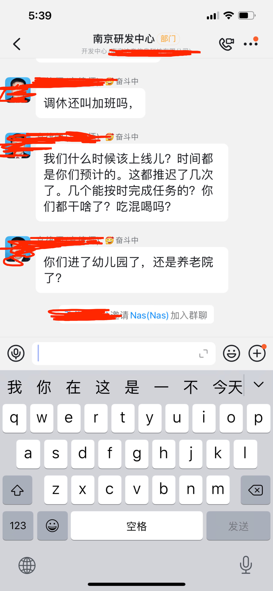

Em setembro, o clima estava tão insuportável que ninguém queria mais ir trabalhar. Todo mundo pediu demissão coletivamente. Fim de jogo.

A empresa faliu. Deixando de lado o prejuízo financeiro — foram cinco ou seis anos da minha vida. Será que posso simplesmente esquecer as noites em claro tocando projetos? E meu colega de escola, que acabei prejudicando? Se tivesse ficado na ByteDance, talvez tivesse um futuro melhor. Eu imaginava a gente comemorando o sucesso da empresa juntos — mas não foi o que aconteceu.

Quando a empresa fechou, não tive coragem nem de pedir desculpas a ele. Minha dor era indescritível. Lembrava dos colegas que lutaram ao meu lado, dos momentos em que vibramos juntos ao superar desafios, às vezes sem dormir de tanta empolgação. Lembrava das minhas promessas, dos meus discursos nas reuniões…

Sinto muito. De verdade.

Quero dizer a eles: "I'm so sorry!" — mesmo que eles nunca leiam isto.

### O Corpo Foi pro Espaço

A partir de junho, por causa dos conflitos com o Sr. Gong sobre a gestão da empresa — e com ele interferindo de forma grosseira — meu corpo começou a dar sinais. Meu estômago piorou. Desenvolvi gastrite erosiva que não sarava. Depois veio a insônia. A gastrite piorou. Aí veio a COVID. Parecia que eu tinha todas as doenças do mundo. Visão embaçada, falta de apetite, insônia crônica, dores pelo corpo todo. Eu estava acabando.

Uma noite, do nada, falei para a Ruohan: "Acho que não vou aguentar." Comecei a delirar, a dar instruções sobre o que fazer depois que eu morresse. Ela chorou alto, acordando nosso filho. Lembro dos dois chorando por um longo tempo — não importava o que eu fizesse, não paravam.

Nos meses seguintes, fui de hospital em hospital em Nanjing. Fila para marcar, fila para esperar, exames de imagem, ressonância, sangue. Eu parecia um fantasma. Meu mundo estava coberto por uma névoa escura — sem fim.

Os exames mostravam problemas pequenos, e os médicos garantiam que não era nada grave. Mas eu sentia que tinha algo que não estava sendo detectado. Todo dia era: marcar consulta, esperar, fazer exame, esperar resultado, consultar de novo, descartar uma doença e testar outra. Pesquisava sintomas em sites, dizia a mim mesmo que estava tudo bem, mas duvidava.

Anos de programação também detonaram minha coluna. Cuidado — isso é irreversível. Só quem passou por isso entende o desespero e a dor. Cuidem do corpo.

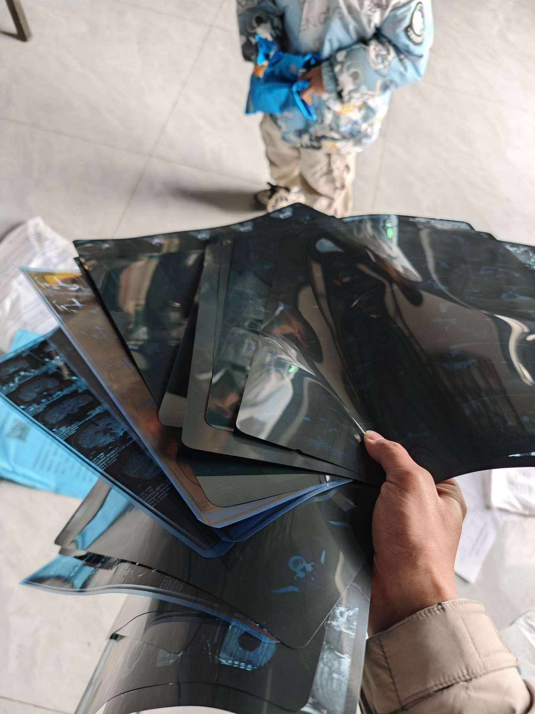

Desesperado, cheguei a procurar médicos tradicionais chineses. Minha família me levou até a benzedeiras.

Eu sabia que aquilo não era caminho, mas passava noites em claro, sem energia.

No total, entre eu e os sócios, perdemos mais de 20 milhões. Somando o prejuízo do resort e do clube, a pressão era insuportável. No pior momento, pensei em vender a casa dos pais da Ruohan. Não pedi dinheiro emprestado a nenhum parente — não conseguia. Sabia que certas palavras, uma vez ditas, mudam as relações. Se for pedir dinheiro, só peça se tiver certeza de que a pessoa vai emprestar. Caso contrário, nem abra a boca.

Cheguei a pensar em vender meu carro (tinha pouco mais de um ano), mas a família não deixou. A casa já tinha ido. Vender o carro também afetaria nossa vida — meu filho ia começar a escola. E não recuperaríamos muito dinheiro.

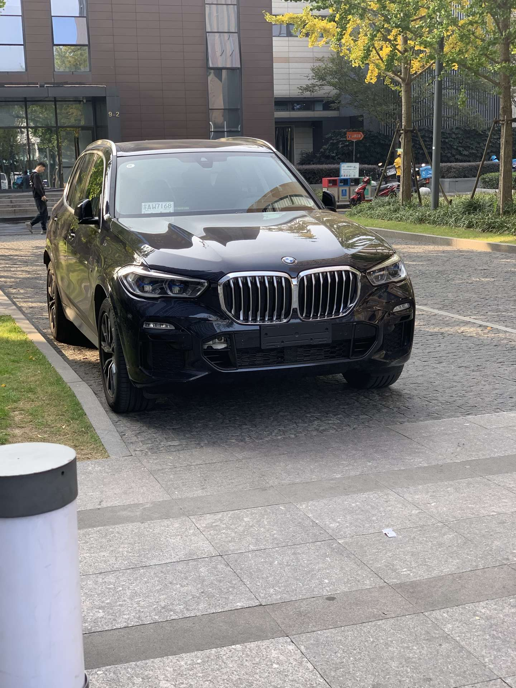

### Volta pra Cidade Natal

No final de março de 2023, transferi o último restaurante. No final de junho, arrumei as malas e voltei para minha cidade.

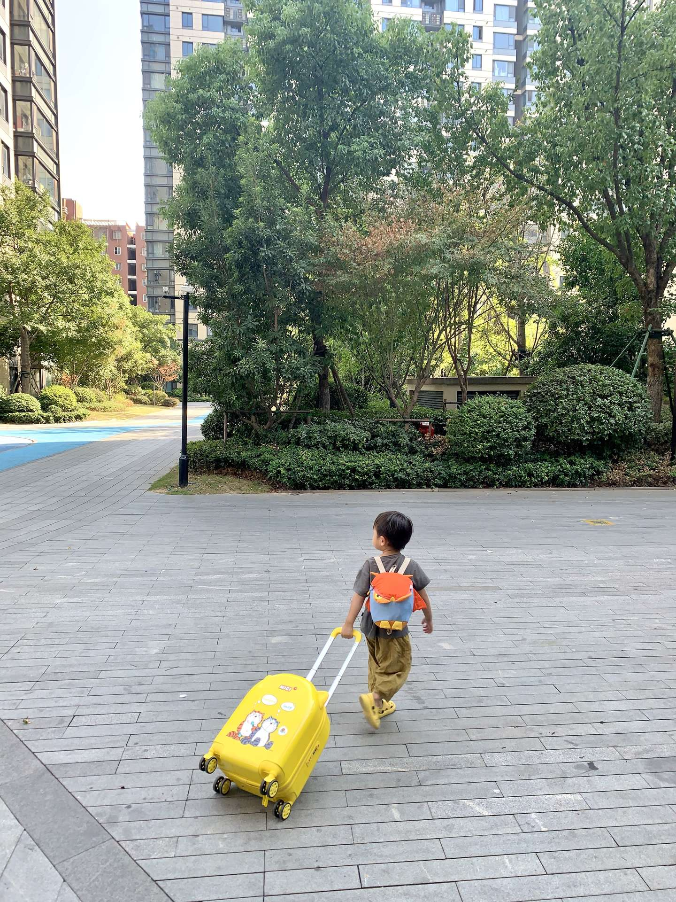

Sair da cidade onde morei por mais de dez anos com meu filho de três anos foi triste.

Minha saúde continuava piorando. Fiquei calado, não queria sair de casa, não queria falar com ninguém — às vezes nem comer.

Se minha mãe não me chamasse no WhatsApp para comer, eu simplesmente não comia.

Poxa, um cara de quase 30 anos fazendo a mãe se preocupar com isso. Que vergonha. Quase cômico.

Eu me odiava por isso. Mas me sentia impotente, como se estivesse no centro de um redemoinho — por mais que tentasse, não conseguia sair.

Ficar tanto tempo sem fazer nada era entediante. Um dia, montei meu desktop e comecei a jogar League of Legends. Jogava sem parar, até ficar entediado de tanto jogar. Mas não conseguia dormir — então continuava.

### Vida Sem Esperança

Viciado em jogos, virando noites, sem ganhar um centavo — um contraste enorme com a vida que eu tinha. A Ruohan não era uma pessoa materialista, mas vender a casa, viver com meus pais, enfrentar decepções todo dia — e eu sem dar sinais de melhora — foi demais para ela. Ela me perguntou até quando aquilo ia durar.

Gritei com ela: "O que você quer que eu faça?"

A verdade é que eu não fazia a menor ideia.

A empresa de software faliu. Minha carreira de programador também. Silenciosamente, saí de vários grupos, desativei o GitHub, bloqueei alguns contatos. Sites que eu visitava todo dia — nunca mais abri.

Durante a empreitada, por causa de dinheiro, briguei com meu melhor amigo, Lele. Anos de amizade — destruídos pela minha teimosia. Não nos falamos mais. Perdi muita coisa.

Perguntei a mim mesmo inúmeras vezes: "Por que diabos eu insisti tanto?"

Se tivesse feito outras escolhas, será que o resultado seria diferente? Se eu tivesse me esforçado mais em momentos-chave… Se tivesse começado antes ou depois… Se eu pudesse…

Pensando bem, fazer software para um segmento específico não depende só de entusiasmo e algumas ideias bonitas. Todo empreendedor acredita que entende as necessidades do cliente, que seu produto resolve um problema do mercado, que vai explodir. Mas o sucesso depende de fatores que você não controla — timing, sorte, contexto. Por exemplo: gastamos uma enormidade desenvolvendo um robô de perguntas e respostas inteligente. Se tivéssemos feito isso depois do ChatGPT, seria outra história. Mas a gente não ia esperar por um ChatGPT que nem sabíamos que existiria.

### Reflexão

Se você me perguntar: "Qual é a sensação de falir uma empresa?"

Só posso dizer: cair jovem não é necessariamente ruim. É só um contratempo na vida.

Na verdade, estou sendo durão. A real é que dói pra caralho.

Lembro bem: no aniversário do meu filho, a Ruohan disse de manhã: "Vamos comer hot pot hoje à noite." Hesitei e respondi: "Precisa? Vamos comprar um bolinho e comemorar em casa." A resposta a pegou de surpresa. Ela ficou em silêncio, foi escovar os dentes, tentando disfarçar a decepção. Porra, desde quando sair para comer virou luxo? E num dia especial, que deveria ser de celebração? Nunca imaginei que chegaria a esse ponto. Essa tristeza — só quem já passou por isso entende.

Naquela noite, fomos ao Haidilao (restaurante de hot pot). Quase não pedimos nada. Quando os garçons cantaram "Tchau, tchau, tchau para todas as preocupações", desabei. Nada é tão fácil assim. Talvez muita gente seja como eu: pode passar pelo pior, mas ver a esposa e o filho passarem por qualquer dificuldade — isso destrói qualquer armadura. Uma coisa pequena, e toda a tristeza e frustração vêm à tona.

## Atualização — 22/04/2026

Muita gente pergunta como estou agora. Ainda estou aqui. Estou bem.

Esclarecimento: este texto tem uma visão muito negativa do sócio Gong. Na verdade, ele é uma pessoa excelente e muito competente. Nos momentos críticos da empresa, nossas visões colidiram — e este texto é do meu ponto de vista, o que cria uma oposição que não reflete a realidade. Ele tem muitas qualidades admiráveis. Mesmo após o fracasso, é preciso continuar aprendendo, evoluindo, e estar sempre pronto para recomeçar. Que essa seja uma lição para todos nós.
